# Bases de Données: Introduction à l’optimisation. Mini-Projet: optimisation

Julien TAP   
ET4 - IIM - Groupe1

---

## Table des Matières

- [Bases de Données: Introduction à l’optimisation. Mini-Projet: optimisation](#bases-de-données-introduction-à-loptimisation-mini-projet-optimisation)
  - [Table des Matières](#table-des-matières)
  - [Exercice 1](#exercice-1)
    - [Partie 1](#partie-1)
      - [Question 1](#question-1)
      - [Question 2](#question-2)
      - [Question 3](#question-3)
      - [Question 4](#question-4)
    - [Partie 2](#partie-2)
      - [Question 1](#question-1-1)
      - [Question 2](#question-2-1)
    - [Partie 3](#partie-3)
      - [Question 1](#question-1-2)
  - [Exercice 2](#exercice-2)
    - [Partie 1](#partie-1-1)
      - [Question 1](#question-1-3)
      - [Question 2](#question-2-2)
      - [Question 3](#question-3-1)
      - [Question 4](#question-4-1)
      - [Question 5](#question-5)
      - [Question 6](#question-6)
    - [Partie 2](#partie-2-1)
      - [Question 1](#question-1-4)
      - [Question 2](#question-2-3)
      - [Question 3](#question-3-2)
      - [Question 4](#question-4-2)
      - [Question 5](#question-5-1)
      - [Question 6](#question-6-1)
      - [Question 7](#question-7)
      - [Question 8](#question-8)
    - [Partie 3](#partie-3-1)
      - [Question 1](#question-1-5)
      - [Question 2](#question-2-4)
      - [Question 3](#question-3-3)
      - [Question 4](#question-4-3)
      - [Question 5](#question-5-2)
      - [Question 6](#question-6-2)
  - [Exercice 3](#exercice-3)
    - [Partie 1](#partie-1-2)
      - [Question 1](#question-1-6)
      - [Question 2](#question-2-5)
      - [Question 3](#question-3-4)
      - [Analyse détaillée des plans d'exécution](#analyse-détaillée-des-plans-dexécution)
        - [Plan 1 (a) - Index sur FILM(ID\_realisateur) et ARTISTE(ID\_artiste)](#plan-1-a---index-sur-filmid_realisateur-et-artisteid_artiste)
        - [Plan 2 (b) - Index sur FILM(ID\_Film) et JOUE(ID\_Artiste)](#plan-2-b---index-sur-filmid_film-et-joueid_artiste)
        - [Plan 3 (c) - Index sur FILM(ID\_Film) et JOUE(ID\_Film)](#plan-3-c---index-sur-filmid_film-et-joueid_film)

---

## Exercice 1

### Partie 1

#### Question 1

Creation des deux tables CLIENTS et OCCUPATION avec les instructions SQL suivantes : 

```sql
CREATE TABLE CLIENT
(
CLI_ID INTEGER ,
TIT_CODE VARCHAR (10) ,
CLI_NOM VARCHAR (30) ,
CLI_PRENOM VARCHAR (30) ,
CLI_ENSEIGNE VARCHAR (50)
);

CREATE TABLE OCCUPATION
(
CHB_ID INTEGER ,
JOUR VARCHAR (10) ,
CLI_ID INTEGER ,
NB_PERS INTEGER ,
RESERVE INTEGER
);
```

#### Question 2

Peuplement des tables CLIENTS et OCCUPATION avec les instructions SQL présentes dans le fichier `fillBaseHotel.sql`.

#### Question 3

Expression des requêtes SQL demandées:

1. Le nom et prénom du client numéro 5
   
```sql
SELECT CLI_NOM, CLI_PRENOM
FROM client
WHERE CLI_ID =5;
```

2. Les jours où le client numéro 5 a occupé une chambre

```sql
SELECT JOUR
FROM OCCUPATION
WHERE CLI_ID = 5;
```

3. Les chambres occupées le 1999-01-22

```sql
SELECT CHB_ID
FROM OCCUPATION
WHERE JOUR = '1999-01-22';
```

4. Le nom et prénom des clients ayant pris une chambre le 1999-01-22

```sql
SELECT CLI_NOM, CLI_PRENOM
FROM CLIENT, OCCUPATION
WHERE CLIENT.CLI_ID = OCCUPATION.CLI_ID
AND OCCUPATION.JOUR = '1999-01-22';
```

#### Question 4

Pour chacune des requêtes précédentes, on donne maintenant le plan d'exécution obtenu avec EXPLAIN, on interprète ce resultat, puis on dessine ce plan sous forme d'arbre.

1. Le nom et prénom du client numéro 5
   
```sql
EXPLAIN SELECT CLI_NOM, CLI_PRENOM
FROM client
WHERE CLI_ID =5;

                      QUERY PLAN                       
-------------------------------------------------------
 Seq Scan on client  (cost=0.00..2.25 rows=1 width=15)
   Filter: (cli_id = 5)
(2 rows)
```

On voit que le plan d'exécution utilise un "Seq Scan" (parcours séquentiel) sur la table client, ce qui signifie que chaque ligne de la table est examinée pour trouver celles qui correspondent à la condition CLI_ID = 5. Le coût estimé de cette opération est de 0.00 à 2.25, avec une estimation de 1 ligne retournée.


2. Les jours où le client numéro 5 a occupé une chambre

```sql
EXPLAIN SELECT JOUR
FROM OCCUPATION
WHERE CLI_ID = 5;

                          QUERY PLAN                           
---------------------------------------------------------------
 Seq Scan on occupation  (cost=0.00..361.27 rows=166 width=11)
   Filter: (cli_id = 5)
(2 rows)
```

On voit que le plan d'exécution utilise également un "Seq Scan" sur la table OCCUPATION pour trouver les enregistrements où CLI_ID = 5. Le coût estimé est de 0.00 à 361.27, avec une estimation de 166 lignes retournées.

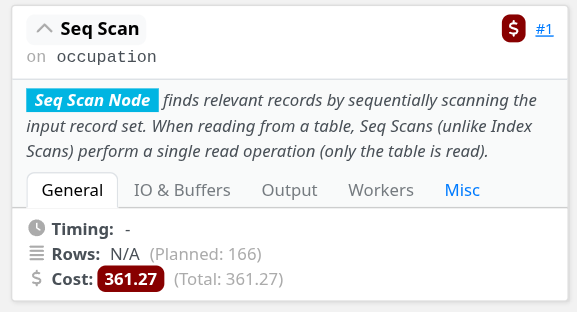

3. Les chambres occupées le 1999-01-22

```sql
EXPLAIN SELECT CHB_ID
FROM OCCUPATION
WHERE JOUR = '1999-01-22';

                         QUERY PLAN                          
-------------------------------------------------------------
 Seq Scan on occupation  (cost=0.00..361.27 rows=11 width=4)
   Filter: ((jour)::text = '1999-01-22'::text)
(2 rows)
```

On voit que le plan d'exécution utilise encore un "Seq Scan" sur la table OCCUPATION pour trouver les enregistrements où JOUR = '1999-01-22'. Le coût estimé est de 0.00 à 361.27, avec une estimation de 11 lignes retournées.

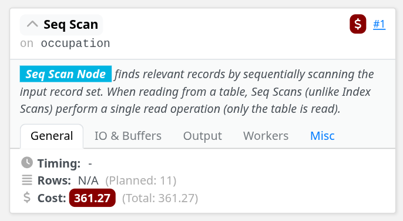

4. Le nom et prénom des clients ayant pris une chambre le 1999-01-22

```sql
EXPLAIN SELECT CLI_NOM, CLI_PRENOM
FROM CLIENT, OCCUPATION
WHERE CLIENT.CLI_ID = OCCUPATION.CLI_ID
AND OCCUPATION.JOUR = '1999-01-22';

                             QUERY PLAN                              
---------------------------------------------------------------------
 Hash Join  (cost=3.25..364.68 rows=11 width=15)
   Hash Cond: (occupation.cli_id = client.cli_id)
   ->  Seq Scan on occupation  (cost=0.00..361.27 rows=11 width=4)
         Filter: ((jour)::text = '1999-01-22'::text)
   ->  Hash  (cost=2.00..2.00 rows=100 width=19)
         ->  Seq Scan on client  (cost=0.00..2.00 rows=100 width=19)
(6 rows)
```

Le plan d'exécution utilise un "Hash Join" pour combiner les tables CLIENT et OCCUPATION en fonction de la condition de jointure. La table OCCUPATION est parcourue séquentiellement pour trouver les enregistrements où JOUR = '1999-01-22', puis une table de hachage est créée à partir de la table CLIENT pour effectuer la jointure. Le coût estimé est de 3.25 à 364.68, avec une estimation de 11 lignes retournées.

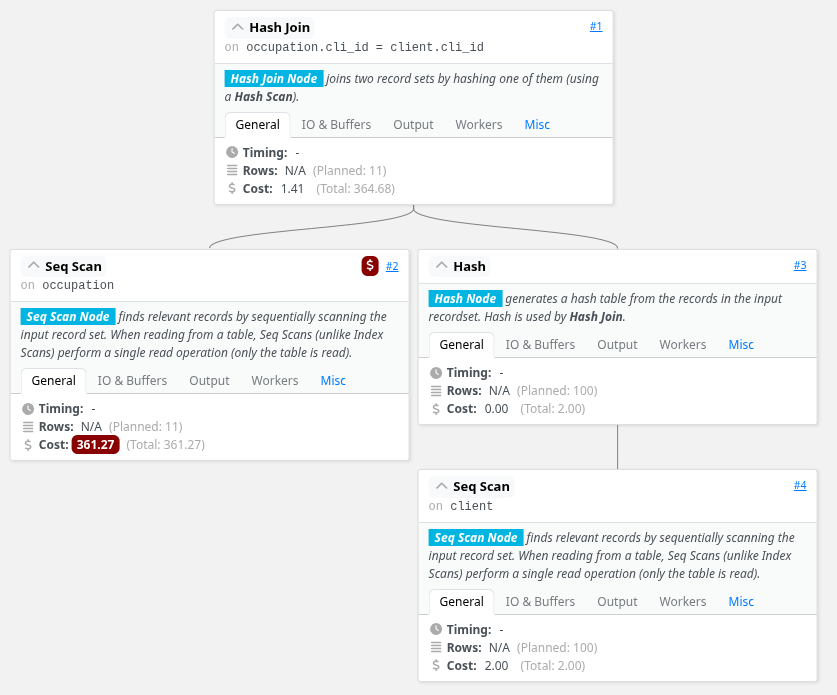

### Partie 2

#### Question 1

On veut maintenant optimiser les requêtes précédentes en créant des index appropriés sur CLIENT.CLI ID,
OCCUPATION.CLI ID et OCCUPATION.JOUR.

```sql
CREATE UNIQUE INDEX idx_client_cli_id ON CLIENT(CLI_ID);
CREATE INDEX idx_occupation_cli_id ON OCCUPATION(CLI_ID);
CREATE INDEX idx_occupation_jour ON OCCUPATION(JOUR);
```

L'index 'idx_client_cli_id' est le seul index unique, car CLI_ID dans la table CLIENT est une clé primaire et doit être unique pour chaque client. Les autres index sont non uniques, car plusieurs enregistrements dans la table OCCUPATION peuvent partager les mêmes valeurs pour CLI_ID ou JOUR.

#### Question 2

On réexécute les requêtes précédentes avec EXPLAIN pour observer les changements dans les plans d'exécution après la création des index.

1. Le nom et prénom du client numéro 5
   
```sql
EXPLAIN SELECT CLI_NOM, CLI_PRENOM
FROM client
WHERE CLI_ID =5;

                      QUERY PLAN                       
-------------------------------------------------------
 Seq Scan on client  (cost=0.00..2.25 rows=1 width=15)
   Filter: (cli_id = 5)
(2 rows)
```

On constate que le plan d'exécution reste un "Seq Scan" sur la table client, ce qui indique que l'index n'a pas été utilisé pour cette requête. Cela peut être dû au fait que la table CLIENT est relativement petite, et le système de gestion de base de données a estimé qu'un parcours séquentiel serait plus efficace que l'utilisation de l'index.

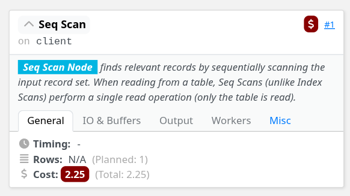

2. Les jours où le client numéro 5 a occupé une chambre

```sql
EXPLAIN SELECT JOUR
FROM OCCUPATION
WHERE CLI_ID = 5;

                                QUERY PLAN                                      
---------------------------------------------------------
 Bitmap Heap Scan on occupation  (cost=5.57..148.74 rows=166 width=11)
   Recheck Cond: (cli_id = 5)
   ->  Bitmap Index Scan on idx_occupation_cli_id  (cost=0.00..5.53 rows=166 width=0)
         Index Cond: (cli_id = 5)
(4 rows)
```

On voit que le plan d'exécution utilise maintenant un "Bitmap Heap Scan" sur la table OCCUPATION, ce qui indique que l'index 'idx_occupation_cli_id' a été utilisé pour trouver les enregistrements où CLI_ID = 5. Le coût estimé est de 5.57 à 148.74, avec une estimation de 166 lignes retournées.

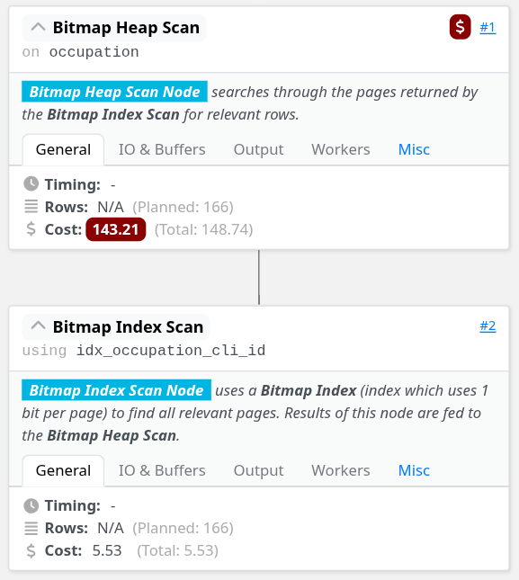

3. Les chambres occupées le 1999-01-22

```sql
EXPLAIN SELECT CHB_ID
FROM OCCUPATION
WHERE JOUR = '1999-01-22';

                                QUERY PLAN                                       
---------------------------------------------------------
 Index Scan using idx_occupation_jour on occupation  (cost=0.29..25.44 rows=11 width=4)
   Index Cond: ((jour)::text = '1999-01-22'::text)
(2 rows)
```

On voit que le plan d'exécution utilise un "Index Scan" sur la table OCCUPATION, ce qui indique que l'index 'idx_occupation_jour' a été utilisé pour trouver les enregistrements où JOUR = '1999-01-22'. Le coût estimé est de 0.29 à 25.44, avec une estimation de 11 lignes retournées.

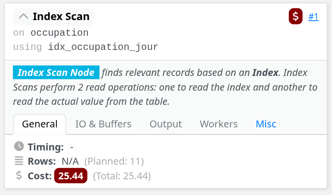

4. Le nom et prénom des clients ayant pris une chambre le 1999-01-22

```sql
EXPLAIN SELECT CLI_NOM, CLI_PRENOM
FROM CLIENT, OCCUPATION
WHERE CLIENT.CLI_ID = OCCUPATION.CLI_ID
AND OCCUPATION.JOUR = '1999-01-22';

                             QUERY PLAN                                          
---------------------------------------------------------
 Hash Join  (cost=3.54..28.72 rows=11 width=15)
   Hash Cond: (occupation.cli_id = client.cli_id)
   ->  Index Scan using idx_occupation_jour on occupation  (cost=0.29..25.44 rows=11 width=4)
         Index Cond: ((jour)::text = '1999-01-22'::text)
   ->  Hash  (cost=2.00..2.00 rows=100 width=19)
         ->  Seq Scan on client  (cost=0.00..2.00 rows=100 width=19)
(6 rows)
```

Le plan d'exécution utilise toujours un "Hash Join" pour combiner les tables CLIENT et OCCUPATION, mais cette fois-ci, l'index 'idx_occupation_jour' est utilisé pour accéder aux enregistrements de la table OCCUPATION. Le coût estimé est de 3.54 à 28.72, avec une estimation de 11 lignes retournées.

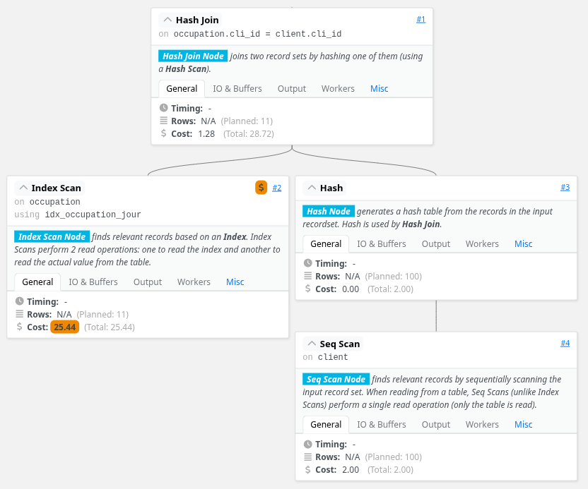

### Partie 3

#### Question 1

On récupère les statistiques sur les tables avec less commandes suivantes :

```sql
ANALYSE CLIENT , OCCUPATION;

ANALYSE VERBOSE CLIENT , OCCUPATION;

INFO:  analyzing "public.client"
INFO:  "client": scanned 1 of 1 pages, containing 100 live rows and 0 dead rows; 100 rows in sample, 100 estimated total rows
INFO:  finished analyzing table "hotels.public.client"
avg read rate: 15.625 MB/s, avg write rate: 0.000 MB/s
buffer usage: 42 hits, 2 reads, 0 dirtied
WAL usage: 9 records, 0 full page images, 1332 bytes, 0 buffers full
system usage: CPU: user: 0.00 s, system: 0.00 s, elapsed: 0.00 s
INFO:  analyzing "public.occupation"
INFO:  "occupation": scanned 134 of 134 pages, containing 18182 live rows and 0 dead rows; 18182 rows in sample, 18182 estimated total rows
INFO:  finished analyzing table "hotels.public.occupation"
avg read rate: 0.000 MB/s, avg write rate: 0.000 MB/s
buffer usage: 170 hits, 0 reads, 0 dirtied
WAL usage: 7 records, 0 full page images, 500 bytes, 0 buffers full
system usage: CPU: user: 0.02 s, system: 0.00 s, elapsed: 0.02 s
```

Les plans d'exécution des requêtes ne changent pas après l'analyse des tables, car les statistiques collectées n'ont pas modifié les estimations de coût ou de cardinalité utilisées par le planificateur de requêtes.

---

## Exercice 2

### Partie 1

Cette première partie consiste à mettre en place les tables et les index nécessaires pour exécuter les requêtes demandées.

#### Question 1

On commence par créer les tables avec les instructions SQL suivantes :

```sql
drop schema if exists optimisation cascade;
create schema optimisation;
set search_path to optimisation ;
--drop table if exists clients cascade;
create unlogged table clients(
NumC integer primary key ,
NomC varchar (35),
AdresseC text
);
--drop table if exists produits cascade;
create unlogged table produits(
NumP integer primary key ,
NomP varchar (35),
descriptif text
);
--drop table if exists commandes cascade;
create unlogged table commandes(
DateCom date ,
NumC integer ,
Commentaire text ,
primary key(DateCom ,NumC)
);
--drop table if exists livraisons ;
create unlogged table livraisons(
DateLiv date ,
DateCom date ,
NumC Integer ,
Prestataire varchar ,
primary key(DateLiv ,DateCom ,NumC)
);
--drop table if exists Concerne;
create unlogged table concerne(
NumP integer ,
DateCom date ,
NumC integer ,
Quantite integer ,
primary key (NumP ,DateCom ,NumC)
);
```

#### Question 2

Il nous faut ensuite executer le script qui implémente une génération aléatoire de tuples afin de tester les performances des charges de travail future

```sql
drop procedure if exists rempli_tables;
create procedure rempli_tables(nbtuples integer)
as $$
declare
k integer;
un_numP integer;
compt integer;
une_date date;
curs_com cursor for select DateCom , numc
from optimisation.commandes;
begin
INSERT INTO optimisation.clients (numc , nomc , adressec)
SELECT g, 'nomc_ '||(( random () * nbtuples * 4 / 5):: integer)::varchar , md5(g::text)
||md5 ((2*g)::text)||md5 ((3*g)::text)
FROM generate_series (0,nbtuples -1) as g;
INSERT INTO optimisation.produits (nump , nomp , descriptif)
SELECT g, 'nomp_ '||(( random () * nbtuples * 4 / 5):: integer)::varchar , md5(g::text)
||md5 ((2*g)::text)||md5 ((3*g)::text)
FROM generate_series (0,nbtuples -1) as g;
for g in 1..4*( nbtuples -1) loop
une_date = CURRENT_TIMESTAMP - (( random () * 3650):: integer ||'day')::
interval;
un_nump =( random ()*(nbtuples -1)):: integer;
insert into optimisation.commandes (DateCom , numc , commentaire)
select une_date , un_nump , md5(g::text)||md5 ((2*g)::text)||md5 ((3*
g)::text) on conflict do nothing;
end loop;
for t in curs_com
loop
k=( random () *6):: integer;
for i in 1..k loop
un_numP = (random ()*(nbtuples -1)):: integer;
insert into optimisation.concerne (NumP ,datecom ,numc ,
quantite)
values (un_nump ,t.Datecom ,t.numc ,( random ()*100):: integer)
on conflict do nothing;
if i>3 then
une_date = t.datecom +(( random () * 30):: integer ||'
days'):: interval;
insert into optimisation.livraisons (DateLiv ,
DateCom , numC , prestataire)
values(une_date ,t.datecom ,t.numc ,'prest '||(( random
() *20):: integer):: varchar) on conflict do
nothing;
end if;end loop;
end loop;
end;
$$language plpgsql;
```

#### Question 3

On exécute la procédure créée précédemment pour insérer des données dans les tables :

```sql
do $$
begin
call rempli_tables (500);
end
$$;
```

#### Question 4

On peut maintenant ajouter les contraintes suivantes :

```sql
alter table optimisation.commandes add CONSTRAINT fk_commande_client foreign key (numc)
references optimisation.clients(NumC) on delete cascade not valid;
alter table optimisation.livraisons add constraint fk_livraison_commande foreign key (
DateCom ,NumC) references optimisation.commandes(DateCom ,NumC) on delete cascade not
valid;
alter table optimisation.concerne add constraint fk_concerne_commande foreign key (DateCom
,NumC) references optimisation.commandes(DateCom ,NumC) on delete cascade not valid;
alter table optimisation.concerne add constraint fk_concerne_produit foreign key (NumP)
references optimisation.produits(NumP) not valid;
```

#### Question 5

On met à jour les statistiques des tables :

```sql
analyse optimisation.clients , optimisation.commandes , optimisation.produits , optimisation.
concerne ,optimisation.livraisons;
```

#### Question 6

Finalement, on peut afficher ses statistiques avec la commande suivante :

```sql
analyse verbose optimisation.clients , optimisation.commandes , optimisation.produits ,
optimisation.concerne ,optimisation.livraisons;

----------------------------------------------

INFO:  analyzing "optimisation.clients"
INFO:  "clients": scanned 9 of 9 pages, containing 500 live rows and 0 dead rows; 500 rows in sample, 500 estimated total rows
INFO:  finished analyzing table "hotels.optimisation.clients"
avg read rate: 0.000 MB/s, avg write rate: 1.953 MB/s
buffer usage: 58 hits, 0 reads, 1 dirtied
WAL usage: 24 records, 0 full page images, 11635 bytes, 0 buffers full
system usage: CPU: user: 0.00 s, system: 0.00 s, elapsed: 0.00 s
INFO:  analyzing "optimisation.commandes"
INFO:  "commandes": scanned 35 of 35 pages, containing 1996 live rows and 0 dead rows; 1996 rows in sample, 1996 estimated total rows
INFO:  finished analyzing table "hotels.optimisation.commandes"
avg read rate: 0.000 MB/s, avg write rate: 5.208 MB/s
buffer usage: 91 hits, 0 reads, 2 dirtied
WAL usage: 24 records, 0 full page images, 11645 bytes, 0 buffers full
system usage: CPU: user: 0.00 s, system: 0.00 s, elapsed: 0.00 s
INFO:  analyzing "optimisation.produits"
INFO:  "produits": scanned 9 of 9 pages, containing 500 live rows and 0 dead rows; 500 rows in sample, 500 estimated total rows
INFO:  finished analyzing table "hotels.optimisation.produits"
avg read rate: 0.000 MB/s, avg write rate: 3.906 MB/s
buffer usage: 58 hits, 0 reads, 1 dirtied
WAL usage: 24 records, 0 full page images, 11643 bytes, 0 buffers full
system usage: CPU: user: 0.00 s, system: 0.00 s, elapsed: 0.00 s
INFO:  analyzing "optimisation.concerne"
INFO:  "concerne": scanned 33 of 33 pages, containing 5991 live rows and 0 dead rows; 5991 rows in sample, 5991 estimated total rows
INFO:  finished analyzing table "hotels.optimisation.concerne"
avg read rate: 0.000 MB/s, avg write rate: 1.953 MB/s
buffer usage: 85 hits, 0 reads, 1 dirtied
WAL usage: 12 records, 0 full page images, 5892 bytes, 0 buffers full
system usage: CPU: user: 0.00 s, system: 0.00 s, elapsed: 0.00 s
INFO:  analyzing "optimisation.livraisons"
INFO:  "livraisons": scanned 10 of 10 pages, containing 1497 live rows and 0 dead rows; 1497 rows in sample, 1497 estimated total rows
INFO:  finished analyzing table "hotels.optimisation.livraisons"
avg read rate: 0.000 MB/s, avg write rate: 0.000 MB/s
buffer usage: 41 hits, 0 reads, 0 dirtied
WAL usage: 5 records, 0 full page images, 366 bytes, 0 buffers full
system usage: CPU: user: 0.00 s, system: 0.00 s, elapsed: 0.00 s
ANALYZE
```

### Partie 2

Dans cette deuxième partie, nous allons répondre à plusieurs demandes par des requêtes SQL, puis nous allons analyser ces requêtes selon les points suivants :

- Le coût total estimé pour le plan d’exécution et le temps réel de l’exécution
- Le nombre de tuples estimé en sortie et la taille en octets de chaque tuple
- Le nombre de blocs lus
- L’accès utilisés vers les tables
- Les algorithmes utilisés

#### Question 1

(REQ1) Listez toutes les informations sur les produits

```sql
--Requête SQL
SELECT *
FROM produits;

--Plan d'exécution
EXPLAIN (analyse,buffers)
SELECT *
FROM produits;

                      QUERY PLAN                                                 
---------------------------------------------------------
 Seq Scan on produits  (cost=0.00..14.00 rows=500 width=110) (actual time=0.020..0.095 rows=500.00 loops=1)
   Buffers: shared hit=9
 Planning Time: 0.078 ms
 Execution Time: 0.154 ms
(4 rows)
```

**Analyse:**

- **Coût total et temps d'exécution:** Le coût estimé va de 0.00 à 14.00 unités. Le temps d'exécution réel est de 0.154 ms, ce qui est très rapide.

- **Nombre de tuples et taille:** La requête retourne 500 lignes estimées (et effectivement 500 lignes), chaque tuple ayant une largeur de 110 octets (tous les champs de la table produits).

- **Nombre de blocs lus:** 9 blocs ont été lus depuis le cache partagé (shared hit=9), aucune lecture disque n'a été nécessaire.

- **Accès aux tables:** Un parcours séquentiel (Seq Scan) est utilisé sur la table produits, ce qui signifie que toutes les lignes sont parcourues.

- **Algorithmes utilisés:** Parcours séquentiel simple sans filtres ni transformations.

#### Question 2

(REQ2) Listez le numéro et le nom de tous les produits

```sql
--Requête SQL
SELECT nump, nomp
FROM produits;

--Plan d'exécution
EXPLAIN (analyse,buffers)
SELECT nump, nomp
FROM produits;

                      QUERY PLAN                                                 
-------------------------------------------------------------------
 Seq Scan on produits  (cost=0.00..14.00 rows=500 width=13) (actual time=0.020..0.069 rows=500.00 loops=1)
   Buffers: shared hit=9
 Planning Time: 0.085 ms
 Execution Time: 0.102 ms
(4 rows)
```

**Analyse:**

- **Coût total et temps d'exécution:** Le coût estimé est de 0.00 à 14.00 unités. Le temps d'exécution réel est de 0.102 ms, légèrement plus rapide que REQ1 car seules deux colonnes sont retournées.

- **Nombre de tuples et taille:** 500 lignes sont retournées (estimation et réalité concordent), avec une largeur de 13 octets par tuple (seulement nump et nomp).

- **Nombre de blocs lus:** 9 blocs lus depuis le cache partagé (shared hit=9).

- **Accès aux tables:** Parcours séquentiel (Seq Scan) sur la table produits.

- **Algorithmes utilisés:** Parcours séquentiel avec projection de colonnes (sélection de nump et nomp uniquement).

#### Question 3

(REQ3) Idem, en ajoutant la clause ”distinct”

```sql
--Requête SQL
SELECT DISTINCT nump, nomp
FROM produits;

--Plan d'exécution
EXPLAIN (analyse,buffers)
SELECT DISTINCT nump, nomp
FROM produits;

                      QUERY PLAN                                                    
--------------------------------------------------------------------
 HashAggregate  (cost=16.50..21.50 rows=500 width=13) (actual time=0.328..0.372 rows=500.00 loops=1)
   Group Key: nump, nomp
   Batches: 1  Memory Usage: 57kB
   Buffers: shared hit=9
   ->  Seq Scan on produits  (cost=0.00..14.00 rows=500 width=13) (actual time=0.014..0.121 rows=500.00 loops=1)
         Buffers: shared hit=9
 Planning:
   Buffers: shared hit=15
 Planning Time: 0.172 ms
 Execution Time: 0.432 ms
(10 rows)
```

**Analyse:**

- **Coût total et temps d'exécution:** Le coût total estimé va de 16.50 à 21.50 unités (plus élevé qu'en REQ2 à cause du HashAggregate). Le temps d'exécution réel est de 0.432 ms.

- **Nombre de tuples et taille:** 500 lignes uniques sont retournées avec une largeur de 13 octets par tuple.

- **Nombre de blocs lus:** 9 blocs lus depuis le cache (shared hit=9), identique aux requêtes précédentes.

- **Accès aux tables:** Parcours séquentiel sur produits, suivi d'un HashAggregate pour éliminer les doublons.

- **Algorithmes utilisés:** 
  - Parcours séquentiel (Seq Scan)
  - HashAggregate pour implémenter le DISTINCT (utilise 57kB de mémoire avec 1 batch)

#### Question 4

(REQ4) Même question en ordonnant le résultat selon le nom des produits

```sql
--Requête SQL
SELECT DISTINCT nump, nomp
FROM produits
ORDER BY nomp;

--Plan d'exécution
EXPLAIN (analyse,buffers)
SELECT DISTINCT nump, nomp
FROM produits
ORDER BY nomp;

                      QUERY PLAN                                                       
------------------------------------------------------------------
 Unique  (cost=36.41..40.16 rows=500 width=13) (actual time=0.975..1.050 rows=500.00 loops=1)
   Buffers: shared hit=9
   ->  Sort  (cost=36.41..37.66 rows=500 width=13) (actual time=0.974..0.992 rows=500.00 loops=1)
         Sort Key: nomp, nump
         Sort Method: quicksort  Memory: 40kB
         Buffers: shared hit=9
         ->  Seq Scan on produits  (cost=0.00..14.00 rows=500 width=13) (actual time=0.027..0.140 rows=500.00 loops=1)
               Buffers: shared hit=9
 Planning Time: 0.211 ms
 Execution Time: 1.103 ms
(10 rows)
```

**Analyse:**

- **Coût total et temps d'exécution:** Le coût estimé va de 36.41 à 40.16 unités (le plus élevé jusqu'ici à cause du tri). Le temps d'exécution réel est de 1.103 ms.

- **Nombre de tuples et taille:** 500 lignes distinctes retournées avec une largeur de 13 octets par tuple.

- **Nombre de blocs lus:** 9 blocs lus depuis le cache partagé (shared hit=9).

- **Accès aux tables:** Parcours séquentiel sur produits, suivi d'un tri et d'une opération Unique.

- **Algorithmes utilisés:**
  - Parcours séquentiel (Seq Scan)
  - Tri (Sort) utilisant l'algorithme quicksort avec 40kB de mémoire
  - Unique pour éliminer les doublons sur les données triées

#### Question 5

(REQ5) Listez les produits dont le nom est ’nomp_ 327’

```sql
--Requête SQL
SELECT *
FROM produits
WHERE nomp = 'nomp_ 327'; -- Je ne sais pas pourquoi tout mes nomp on un espace avant leur numéro

--Plan d'exécution
EXPLAIN (analyse,buffers)
SELECT *
FROM produits
WHERE nomp = 'nomp_ 327';

                      QUERY PLAN                                               
---------------------------------------------------------------------
 Seq Scan on produits  (cost=0.00..15.25 rows=1 width=110) (actual time=0.062..0.091 rows=2.00 loops=1)
   Filter: ((nomp)::text = 'nomp_ 327'::text)
   Rows Removed by Filter: 498
   Buffers: shared hit=9
 Planning Time: 0.087 ms
 Execution Time: 0.109 ms
(6 rows)
```

**Analyse:**

- **Coût total et temps d'exécution:** Le coût estimé va de 0.00 à 15.25 unités. Le temps d'exécution réel est de 0.109 ms, très rapide malgré le filtrage.

- **Nombre de tuples et taille:** 1 ligne estimée en sortie mais 2 lignes effectivement retournées, avec une largeur de 110 octets (tous les champs).

- **Nombre de blocs lus:** 9 blocs lus depuis le cache partagé (shared hit=9).

- **Accès aux tables:** Parcours séquentiel (Seq Scan) avec un filtre sur nomp. 498 lignes ont été écartées par le filtre.

- **Algorithmes utilisés:** Parcours séquentiel avec filtre (Filter: (nomp)::text = 'nomp_ 327'::text).

#### Question 6

(REQ6) Donnez le nombre de commandes par client (numc, nombre)

```sql
--Requête SQL
SELECT numc, COUNT(*) AS nombre
FROM commandes
GROUP BY numc;

--Plan d'exécution
EXPLAIN (analyse,buffers)
SELECT numc, COUNT(*) AS nombre
FROM commandes
GROUP BY numc;

                      QUERY PLAN                                                     
-------------------------------------------------------------------------
 HashAggregate  (cost=64.94..69.86 rows=492 width=12) (actual time=0.451..0.497 rows=492.00 loops=1)
   Group Key: numc
   Batches: 1  Memory Usage: 73kB
   Buffers: shared hit=35
   ->  Seq Scan on commandes  (cost=0.00..54.96 rows=1996 width=4) (actual time=0.021..0.147 rows=1996.00 loops=1)
         Buffers: shared hit=35
 Planning Time: 0.132 ms
 Execution Time: 0.555 ms
(8 rows)
```

**Analyse:**

- **Coût total et temps d'exécution:** Le coût estimé va de 64.94 à 69.86 unités. Le temps d'exécution réel est de 0.555 ms.

- **Nombre de tuples et taille:** 492 lignes estimées (et effectivement retournées) avec une largeur de 12 octets par tuple (numc en integer + count en bigint).

- **Nombre de blocs lus:** 35 blocs lus depuis le cache partagé (shared hit=35), plus que pour la table produits car la table commandes est plus grande.

- **Accès aux tables:** Parcours séquentiel sur la table commandes (1996 lignes lues), suivi d'un HashAggregate pour le regroupement.

- **Algorithmes utilisés:**
  - Parcours séquentiel (Seq Scan) sur commandes
  - HashAggregate pour implémenter le GROUP BY (utilise 73kB de mémoire avec 1 batch)

#### Question 7

(REQ7) Donnez les infos sur chaque commande, sous la forme (’nom du client’, ’date de la
commande’). Quelle est la m ́ethode de jointure utilis ́ee ? Pourquoi les relations sont elles
consid ́er ́ees dans cet ordre dans le plan d’ex ́ecution ? Pourquoi la table commande n’est pas
utilis ́ee en fait ?

```sql
--Requête SQL
SELECT cl.nomc AS "Nom du client", co.datecom as "Date de la commande"
FROM commandes AS co
JOIN clients AS cl ON co.numc = cl.numc;

--Plan d'exécution
EXPLAIN (analyse,buffers)
SELECT cl.nomc AS "Nom du client", co.datecom as "Date de la commande"
FROM commandes AS co
JOIN clients AS cl ON co.numc = cl.numc;

                      QUERY PLAN                                                        
-----------------------------------------------------------------
 Hash Join  (cost=20.25..80.49 rows=1996 width=13) (actual time=0.269..1.762 rows=1996.00 loops=1)
   Hash Cond: (co.numc = cl.numc)
   Buffers: shared hit=44
   ->  Seq Scan on commandes co  (cost=0.00..54.96 rows=1996 width=8) (actual time=0.012..0.353 rows=1996.00 loops=1)
         Buffers: shared hit=35
   ->  Hash  (cost=14.00..14.00 rows=500 width=13) (actual time=0.229..0.231 rows=500.00 loops=1)
         Buckets: 1024  Batches: 1  Memory Usage: 32kB
         Buffers: shared hit=9
         ->  Seq Scan on clients cl  (cost=0.00..14.00 rows=500 width=13) (actual time=0.012..0.108 rows=500.00 loops=1)
               Buffers: shared hit=9
 Planning:
   Buffers: shared hit=6
 Planning Time: 0.345 ms
 Execution Time: 2.062 ms
(14 rows)
```

**Analyse:**

- **Coût total et temps d'exécution:** Le coût total estimé va de 20.25 à 80.49 unités. Le temps d'exécution réel est de 2.062 ms.

- **Nombre de tuples et taille:** 1996 lignes retournées (estimation et réalité concordent) avec une largeur de 13 octets par tuple (nomc + datecom).

- **Nombre de blocs lus:** 44 blocs au total lus depuis le cache (35 pour commandes + 9 pour clients).

- **Accès aux tables:**
  - Parcours séquentiel sur la table commandes (1996 lignes)
  - Parcours séquentiel sur la table clients (500 lignes) pour construire la table de hachage
  - Hash Join pour combiner les deux tables

- **Algorithmes utilisés:**
  - Seq Scan sur les deux tables
  - Hash Join: la table clients (plus petite) est utilisée pour construire une table de hachage (32kB, 1024 buckets, 1 batch), puis la table commandes est parcourue pour trouver les correspondances
  - La méthode Hash Join est choisie car elle est efficace pour joindre deux tables de tailles moyennes
  - L'ordre (commandes puis clients) est choisi car clients est plus petite et peut être chargée entièrement en mémoire dans la table de hachage


#### Question 8

Pour cette question, on nous donne la requête SQL suivante :

```sql
explain -- Attention , pas de mot clé "analyse" ici car la requête ne termine pas !
select distinct nomc , nomp
from optimisation.clients ,optimisation.concerne , optimisation.produits , optimisation.commandes ,
optimisation.livraisons
where optimisation.clients.numc = optimisation.commandes.numc
and optimisation.commandes.datecom = optimisation.concerne.datecom
and optimisation.commandes.numc=optimisation.concerne.numc
and optimisation.produits.nump=optimisation.concerne.nump;

                      QUERY PLAN                                                 
-----------------------------------------------------------------
 HashAggregate  (cost=98217.11..99026.51 rows=80940 width=18)
   Group Key: clients.nomc, produits.nomp
   ->  Merge Join  (cost=541.30..53374.48 rows=8968527 width=18)
         Merge Cond: ((commandes.datecom = concerne.datecom) AND (commandes.numc = clients.numc))
         ->  Nested Loop  (cost=0.28..37453.08 rows=2988012 width=8)
               ->  Index Only Scan using commandes_pkey on commandes  (cost=0.28..74.22 rows=1996 width=8)
               ->  Materialize  (cost=0.00..32.45 rows=1497 width=0)
                     ->  Seq Scan on livraisons  (cost=0.00..24.97 rows=1497 width=0)
         ->  Sort  (cost=541.02..556.00 rows=5991 width=30)
               Sort Key: concerne.datecom, clients.numc
               ->  Hash Join  (cost=40.50..165.13 rows=5991 width=30)
                     Hash Cond: (concerne.nump = produits.nump)
                     ->  Hash Join  (cost=20.25..129.02 rows=5991 width=25)
                           Hash Cond: (concerne.numc = clients.numc)
                           ->  Seq Scan on concerne  (cost=0.00..92.91 rows=5991 width=12)
                           ->  Hash  (cost=14.00..14.00 rows=500 width=13)
                                 ->  Seq Scan on clients  (cost=0.00..14.00 rows=500 width=13)
                     ->  Hash  (cost=14.00..14.00 rows=500 width=13)
                           ->  Seq Scan on produits  (cost=0.00..14.00 rows=500 width=13)
(19 rows)
```

**Analyse:**

- **Coût total et temps d'exécution:** Le coût total estimé est extrêmement élevé, allant de 98217.11 à 99026.51 unités. Le temps d'exécution réel n'est pas disponible car la requête n'a pas été exécutée avec ANALYZE (elle ne termine pas dans un temps raisonnable).

- **Nombre de tuples et taille:** 80940 lignes distinctes estimées en sortie avec une largeur de 18 octets par tuple (nomc + nomp). L'estimation intermédiaire du Merge Join est de 8968527 lignes, ce qui est énorme.

- **Nombre de blocs lus:** Non disponible sans exécution réelle.

- **Accès aux tables:**
  - Index Only Scan sur commandes (via commandes_pkey)
  - Seq Scan sur livraisons (1497 lignes)
  - Seq Scan sur concerne (5991 lignes)
  - Seq Scan sur clients (500 lignes)
  - Seq Scan sur produits (500 lignes)

- **Algorithmes utilisés:**
  - **Nested Loop:** Jointure en boucle imbriquée entre commandes et livraisons, produisant 2988012 lignes estimées (produit cartésien car aucune condition de jointure entre ces tables)
  - **Hash Join:** Utilisé deux fois pour joindre concerne avec clients puis avec produits
  - **Sort:** Tri des résultats de la jointure hash avant le Merge Join
  - **Merge Join:** Jointure par fusion entre le résultat du Nested Loop et les données triées
  - **HashAggregate:** Pour implémenter le DISTINCT final
  - **Materialize:** Pour matérialiser la table livraisons dans la boucle imbriquée

**Problème:** La table livraisons n'a aucune condition de jointure avec les autres tables, ce qui crée un produit cartésien massif. Chaque ligne de commandes est combinée avec toutes les lignes de livraisons, multipliant artificiellement le nombre de lignes intermédiaires.

### Partie 3

Dans cette troisième partie, une serie de requêtes SQL nous est proposée afin d'analyser leurs plans d'exécution, puis d'optimiser ces requêtes en créant des index appropriés.

#### Question 1

On nous donne la commande SQL pour afficher la liste des index existants dans le schéma optimisation :

```sql
SELECT
tablename ,
indexname ,
indexdef
FROM
pg_indexes
WHERE
schemaname = 'optimisation '
ORDER BY
tablename ,
indexname;

 tablename | indexname | indexdef 
-----------+-----------+----------
(0 rows)
```

Pour le début de cette partie, aucune index n'a été créé sur aucune table du schéma optimisation.

#### Question 2

Pour les trois requêtes de cette question, on commence par afficher le plan d'execution, puis on l'affiche sous forme de graphique en arbre.

1. Requête 1

```sql
--Requête SQL
Select *
from optimisation.commandes
where numC='116'
and datecom='2025-09-01';

--Plan d'exécution
EXPLAIN (analyse,buffers)
Select *
from optimisation.commandes
where numC='116'
and datecom='2025-09-01';

                      QUERY PLAN                                                           
-------------------------------------------------------------
 Index Scan using commandes_pkey on commandes  (cost=0.28..8.30 rows=1 width=105) (actual time=0.034..0.037 rows=1.00 loops=1)
   Index Cond: ((datecom = '2025-09-01'::date) AND (numc = 116))
   Index Searches: 1
   Buffers: shared hit=3
 Planning Time: 0.165 ms
 Execution Time: 0.071 ms
(6 rows)
```

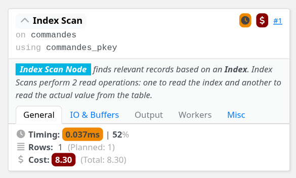

2. Requête 2

```sql
--Requête SQL
Select *
from optimisation.commandes
where datecom='2025-09-01';

--Plan d'exécution
EXPLAIN (analyse,buffers)
Select *
from optimisation.commandes
where datecom='2025-09-01';

                      QUERY PLAN                                                           
-----------------------------------------------------------------------
 Index Scan using commandes_pkey on commandes  (cost=0.28..8.29 rows=1 width=105) (actual time=0.031..0.034 rows=1.00 loops=1)
   Index Cond: (datecom = '2025-09-01'::date)
   Index Searches: 1
   Buffers: shared hit=3
 Planning Time: 0.144 ms
 Execution Time: 0.067 ms
(6 rows)
```

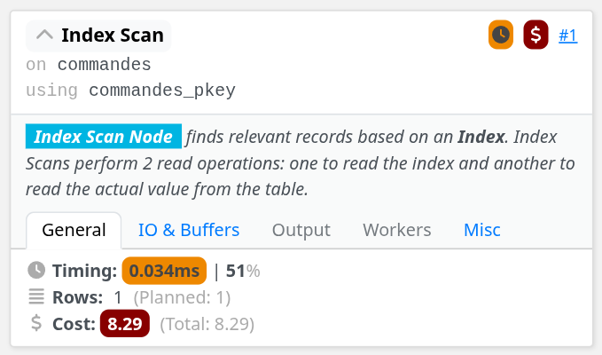

3. Requête 3

```sql
--Requête SQL
Select *
from optimisation.commandes
where numC='116';

--Plan d'exécution
EXPLAIN (analyse,buffers)
Select *
from optimisation.commandes
where numC='116';

                      QUERY PLAN                                                
-----------------------------------------------------------------------------
 Seq Scan on commandes  (cost=0.00..59.95 rows=6 width=105) (actual time=0.036..0.529 rows=6.00 loops=1)
   Filter: (numc = 116)
   Rows Removed by Filter: 1990
   Buffers: shared hit=35
 Planning Time: 0.146 ms
 Execution Time: 0.561 ms
(6 rows)
```

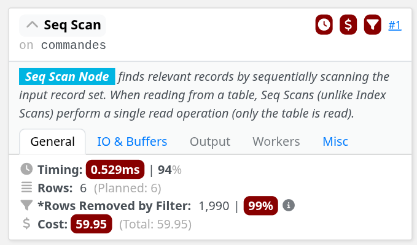

On remarque que pour les deux premières requêtes, le plan d'exécution utilise un "Index Scan" sur l'index primaire 'commandes_pkey', ce qui permet un accès rapide aux enregistrements correspondants. Cependant, pour la troisième requête, le plan d'exécution utilise un parcours séquentiel car il n'y a pas d'index sur la colonne 'numC' seule, ce qui entraîne une lecture complète de la table commandes qui est moins efficace.
De ce fait, si la recherche par 'numC' est fréquente, il serait judicieux de créer un index sur cette colonne pour améliorer les performances des requêtes similaires à la troisième.

#### Question 3

On nous donne la commande SQL suivante :

```sql
Select nomp
from optimisation.produits p
join optimisation.concerne co using(nump)
join optimisation.clients c using(numc)
where nomc='nomc_ 7';
```

On donne donc son plan d'exécution :

```sql
EXPLAIN (analyse,buffers)
Select nomp
from optimisation.produits p
join optimisation.concerne co using(nump)
join optimisation.clients c using(numc)
where nomc='nomc_ 7';

                      QUERY PLAN                                                            
--------------------------------------------------------
 Hash Join  (cost=125.40..142.11 rows=84 width=9) (actual time=2.652..2.705 rows=101.00 loops=1)
   Hash Cond: (p.nump = co.nump)
   Buffers: shared hit=51
   ->  Seq Scan on produits p  (cost=0.00..14.00 rows=500 width=13) (actual time=0.019..0.044 rows=500.00 loops=1)
         Buffers: shared hit=9
   ->  Hash  (cost=124.35..124.35 rows=84 width=4) (actual time=2.626..2.626 rows=101.00 loops=1)
         Buckets: 1024  Batches: 1  Memory Usage: 12kB
         Buffers: shared hit=42
         ->  Hash Join  (cost=15.34..124.35 rows=84 width=4) (actual time=0.237..2.592 rows=101.00 loops=1)
               Hash Cond: (co.numc = c.numc)
               Buffers: shared hit=42
               ->  Seq Scan on concerne co  (cost=0.00..93.10 rows=6010 width=8) (actual time=0.013..1.088 rows=6010.00 loops=1)
                     Buffers: shared hit=33
               ->  Hash  (cost=15.25..15.25 rows=7 width=4) (actual time=0.155..0.155 rows=7.00 loops=1)
                     Buckets: 1024  Batches: 1  Memory Usage: 9kB
                     Buffers: shared hit=9
                     ->  Seq Scan on clients c  (cost=0.00..15.25 rows=7 width=4) (actual time=0.021..0.146 rows=7.00 loops=1)
                           Filter: ((nomc)::text = 'nomc_ 7'::text)
                           Rows Removed by Filter: 493
                           Buffers: shared hit=9
 Planning:
   Buffers: shared hit=49
 Planning Time: 1.134 ms
 Execution Time: 2.775 ms
(24 rows)
```

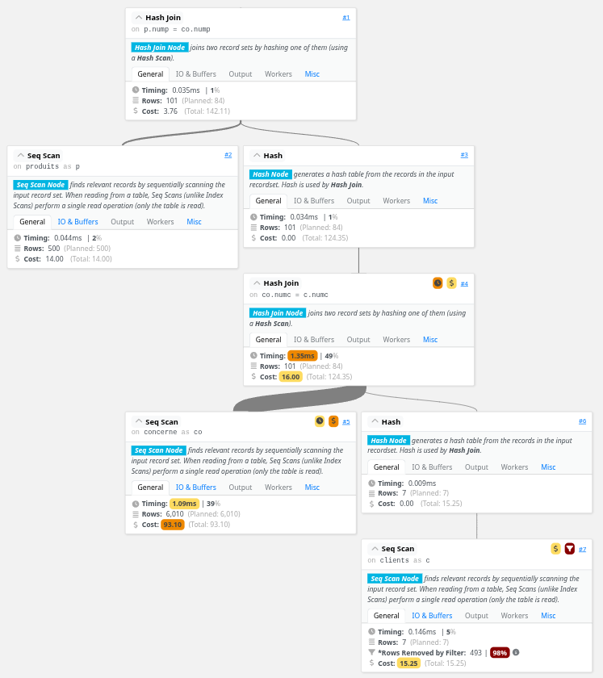

Pour optimiser cette requête, on peut créer les deux index suivants :

```sql
CREATE INDEX idx_clients_nomc ON optimisation.clients(nomc);
CREATE INDEX idx_concerne_numc ON optimisation.concerne(numc);

analyse optimisation.clients , optimisation.commandes , optimisation.produits , optimisation.
concerne ,optimisation.livraisons;
```

Le plan d'exécution après création des index devient :

```sql
EXPLAIN (analyse,buffers)
Select nomp
from optimisation.produits p
join optimisation.concerne co using(nump)
join optimisation.clients c using(numc)
where nomc='nomc_ 7';

                      QUERY PLAN                                                                     
-------------------------------------------------------
 Hash Join  (cost=123.86..140.58 rows=84 width=9) (actual time=0.637..0.708 rows=101.00 loops=1)
   Hash Cond: (p.nump = co.nump)
   Buffers: shared hit=49 read=2
   ->  Seq Scan on produits p  (cost=0.00..14.00 rows=500 width=13) (actual time=0.005..0.038 rows=500.00 loops=1)
         Buffers: shared hit=9
   ->  Hash  (cost=122.81..122.81 rows=84 width=4) (actual time=0.629..0.631 rows=101.00 loops=1)
         Buckets: 1024  Batches: 1  Memory Usage: 12kB
         Buffers: shared hit=40 read=2
         ->  Hash Join  (cost=13.80..122.81 rows=84 width=4) (actual time=0.047..0.622 rows=101.00 loops=1)
               Hash Cond: (co.numc = c.numc)
               Buffers: shared hit=40 read=2
               ->  Seq Scan on concerne co  (cost=0.00..93.10 rows=6010 width=8) (actual time=0.003..0.282 rows=6010.00 loops=1)
                     Buffers: shared hit=33
               ->  Hash  (cost=13.72..13.72 rows=7 width=4) (actual time=0.031..0.031 rows=7.00 loops=1)
                     Buckets: 1024  Batches: 1  Memory Usage: 9kB
                     Buffers: shared hit=7 read=2
                     ->  Bitmap Heap Scan on clients c  (cost=4.33..13.72 rows=7 width=4) (actual time=0.024..0.028 rows=7.00 loops=1)
                           Recheck Cond: ((nomc)::text = 'nomc_ 7'::text)
                           Heap Blocks: exact=7
                           Buffers: shared hit=7 read=2
                           ->  Bitmap Index Scan on idx_clients_nomc  (cost=0.00..4.33 rows=7 width=0) (actual time=0.019..0.019 rows=7.00 loops=1)
                                 Index Cond: ((nomc)::text = 'nomc_ 7'::text)
                                 Index Searches: 1
                                 Buffers: shared read=2
 Planning:
   Buffers: shared hit=52 read=5
 Planning Time: 1.190 ms
 Execution Time: 0.730 ms
(28 rows)
```

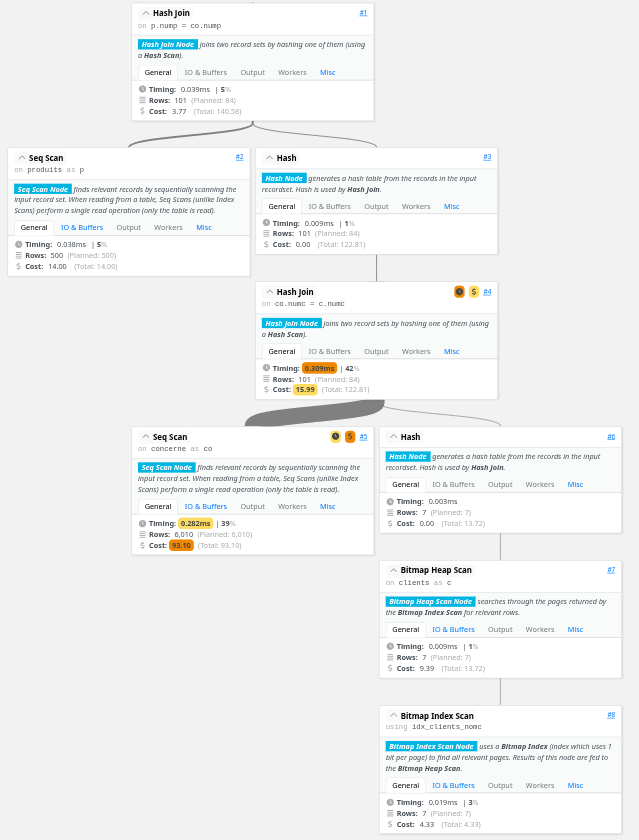

On peut maintenant supprimer les index créés précédemment pour ne pas impacter les prochaines questions :

```sql
DROP INDEX IF EXISTS idx_clients_nomc;
DROP INDEX IF EXISTS idx_concerne_numc;
```

On remarque que le temps d'exécution est passé de 2.775 ms à 0.730 ms, soit une amélioration significative des performances grâce aux index créés.

#### Question 4

Pour cette question, on veut comparer les plans d'exécutions des trois requêtes suivantes :

1. Requête 1

```sql
--Requête SQL
Select numc
from optimisation.clients
where numc not in
(select numc from optimisation.livraisons);

--Plan d'exécution
EXPLAIN (analyse,buffers)
Select numc
from optimisation.clients
where numc not in
(select numc from optimisation.livraisons);

                      QUERY PLAN                                                      
--------------------------------------------------------
 Seq Scan on clients  (cost=28.79..44.04 rows=250 width=4) (actual time=0.476..0.576 rows=90.00 loops=1)
   Filter: (NOT (ANY (numc = (hashed SubPlan 1).col1)))
   Rows Removed by Filter: 410
   Buffers: shared hit=19
   SubPlan 1
     ->  Seq Scan on livraisons  (cost=0.00..25.03 rows=1503 width=4) (actual time=0.004..0.188 rows=1503.00 loops=1)
           Buffers: shared hit=10
 Planning:
   Buffers: shared hit=25 dirtied=5
 Planning Time: 0.245 ms
 Execution Time: 0.602 ms
(11 rows)
```

2. Requête 2

```sql
--Requête SQL
Select numc
from optimisation.clients
except
select numc
from optimisation.livraisons;

--Plan d'exécution
EXPLAIN (analyse,buffers)
Select numc
from optimisation.clients
except
select numc
from optimisation.livraisons;

                      QUERY PLAN                                                     
--------------------------------------------------------
 HashSetOp Except  (cost=44.04..45.29 rows=500 width=4) (actual time=1.377..1.428 rows=90.00 loops=1)
   Buffers: shared hit=19
   ->  Seq Scan on clients  (cost=0.00..14.00 rows=500 width=4) (actual time=0.025..0.180 rows=500.00 loops=1)
         Buffers: shared hit=9
   ->  Seq Scan on livraisons  (cost=0.00..25.03 rows=1503 width=4) (actual time=0.008..0.410 rows=1503.00 loops=1)
         Buffers: shared hit=10
 Planning Time: 0.195 ms
 Execution Time: 1.484 ms
(8 rows)
```

3. Requête 3

```sql
--Requête SQL
Select numc
from optimisation.clients
where not exists
(select numc from optimisation.livraisons
where optimisation.livraisons.numc=optimisation.clients.numc);

--Plan d'exécution
EXPLAIN (analyse,buffers)
Select numc
from optimisation.clients
where not exists
(select numc from optimisation.livraisons
where optimisation.livraisons.numc=optimisation.clients.numc);

                                                     QUERY PLAN                                                      
---------------------------------------------------------------------------------------------------------------------
 Hash Right Anti Join  (cost=20.25..62.93 rows=90 width=4) (actual time=1.309..1.363 rows=90.00 loops=1)
   Hash Cond: (livraisons.numc = clients.numc)
   Buffers: shared hit=19
   ->  Seq Scan on livraisons  (cost=0.00..25.03 rows=1503 width=4) (actual time=0.009..0.296 rows=1503.00 loops=1)
         Buffers: shared hit=10
   ->  Hash  (cost=14.00..14.00 rows=500 width=4) (actual time=0.368..0.370 rows=500.00 loops=1)
         Buckets: 1024  Batches: 1  Memory Usage: 26kB
         Buffers: shared hit=9
         ->  Seq Scan on clients  (cost=0.00..14.00 rows=500 width=4) (actual time=0.020..0.182 rows=500.00 loops=1)
               Buffers: shared hit=9
 Planning:
   Buffers: shared hit=12
 Planning Time: 0.539 ms
 Execution Time: 1.420 ms
(14 rows)
```

**Comparaison des plans d'exécution :**

Les trois requêtes produisent le même résultat (90 clients qui n'ont pas de livraisons) mais utilisent des stratégies d'exécution différentes avec des performances distinctes :

**1. Approche NOT IN (Requête 1) - La plus performante**

- **Temps d'exécution :** 0.602 ms
- **Coût estimé :** 44.04 unités
- **Stratégie :** Utilise un "Hashed SubPlan" où la sous-requête est exécutée une seule fois pour créer une table de hachage en mémoire des numc de livraisons. Ensuite, un parcours séquentiel de clients vérifie pour chaque ligne si le numc est présent dans cette table de hachage.
- **Avantages :** C'est la méthode la plus rapide car la recherche dans une table de hachage est en O(1). La sous-requête n'est exécutée qu'une seule fois (1503 lignes lues).
- **Inconvénient potentiel :** Peut être problématique si la sous-requête retourne des valeurs NULL (comportement spécifique de NOT IN).

**2. Approche EXCEPT (Requête 2) - Performance moyenne**

- **Temps d'exécution :** 1.484 ms (2.5x plus lent que NOT IN)
- **Coût estimé :** 45.29 unités
- **Stratégie :** Utilise "HashSetOp Except" qui traite les deux ensembles comme des opérations ensemblistes. Les deux tables sont parcourues séquentiellement (500 clients + 1503 livraisons = 2003 lignes) et un HashSetOp effectue la différence ensembliste.
- **Avantages :** Sémantique claire et standard SQL. Gère automatiquement les NULL et élimine les doublons.
- **Inconvénient :** Plus lent car nécessite de traiter toutes les lignes des deux tables avant de calculer la différence. Plus coûteux en mémoire pour gérer les deux ensembles.

**3. Approche NOT EXISTS (Requête 3) - Performance moyenne-bonne**

- **Temps d'exécution :** 1.420 ms (2.4x plus lent que NOT IN)
- **Coût estimé :** 62.93 unités (le plus élevé)
- **Stratégie :** Utilise un "Hash Right Anti Join" où clients est chargé dans une table de hachage (26kB, 1024 buckets), puis livraisons est parcourue pour trouver les correspondances et les éliminer (anti-jointure).
- **Avantages :** Excellente pour les requêtes corrélées car l'optimiseur peut la transformer en anti-jointure efficace. Sémantique claire et gestion correcte des NULL.
- **Inconvénient :** Le coût estimé est le plus élevé (62.93) bien que le temps d'exécution soit similaire à EXCEPT. Nécessite plus de mémoire pour la table de hachage.

**Conclusions :**

- NOT IN est clairement le plus performant (0.602 ms vs ~1.4 ms pour les autres).
- NOT IN bénéficie d'une optimisation spéciale avec le "Hashed SubPlan" qui évite une jointure coûteuse.
- EXCEPT et NOT EXISTS ont des performances similaires mais utilisent des stratégies différentes

#### Question 5

On nous donne la commande suivante qu'il va falloir optimiser :

```sql
Select upper(nomc), adressec
From clients
Where upper(nomc)='NOMC_ 7';
```

On donne son plan d'exécution initial :

```sql
EXPLAIN (analyse,buffers)
Select upper(nomc), adressec
From clients
Where upper(nomc)='NOMC_ 7';

                      QUERY PLAN                                               
--------------------------------------------------
 Seq Scan on clients  (cost=0.00..16.50 rows=2 width=129) (actual time=0.244..0.780 rows=7.00 loops=1)
   Filter: (upper((nomc)::text) = 'NOMC_ 7'::text)
   Rows Removed by Filter: 493
   Buffers: shared hit=9
 Planning:
   Buffers: shared hit=14
 Planning Time: 0.243 ms
 Execution Time: 0.810 ms
(8 rows)
```

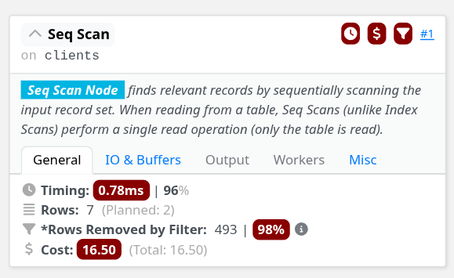

Pour optimiser cette requête, on peut créer un index fonctionnel sur la colonne `nomc` en utilisant la fonction `upper`. Cela permettra à PostgreSQL d'utiliser l'index lors de l'exécution de la requête, évitant ainsi un parcours séquentiel complet de la table.

```sql
CREATE INDEX idx_clients_upper_nomc ON optimisation.clients(upper(nomc));

analyse optimisation.clients;
```

Le plan d'exécution après création de l'index devient :

```sql
EXPLAIN (analyse,buffers)
Select upper(nomc), adressec
From clients
Where upper(nomc)='NOMC_ 7';

                      QUERY PLAN                                                            
--------------------------------------------------
 Bitmap Heap Scan on clients  (cost=4.33..13.75 rows=7 width=129) (actual time=0.127..0.150 rows=7.00 loops=1)
   Recheck Cond: (upper((nomc)::text) = 'NOMC_ 7'::text)
   Heap Blocks: exact=7
   Buffers: shared hit=7 read=2
   ->  Bitmap Index Scan on idx_clients_upper_nomc  (cost=0.00..4.33 rows=7 width=0) (actual time=0.091..0.092 rows=7.00 loops=1)
         Index Cond: (upper((nomc)::text) = 'NOMC_ 7'::text)
         Index Searches: 1
         Buffers: shared read=2
 Planning:
   Buffers: shared hit=15 read=1
 Planning Time: 0.459 ms
 Execution Time: 0.188 ms
(12 rows)
```

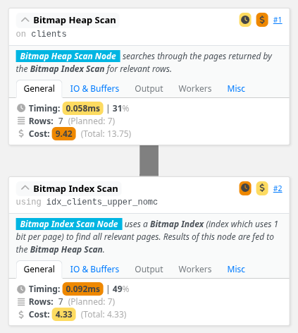

On peut maintenant supprimer l'index créé précédemment pour ne pas impacter les prochaines questions :

```sql
DROP INDEX IF EXISTS idx_clients_upper_nomc;
```

#### Question 6

Pour cette question, on nous donne une requête SQL mal écrite qu'il va falloir optimiser :

```sql
SELECT COUNT (*)
FROM commandes
WHERE EXTRACT(YEAR FROM datecom) = 2017;
```

On donne son plan d'exécution initial :

```sql
EXPLAIN (analyse,buffers)
SELECT COUNT (*)
FROM commandes
WHERE EXTRACT(YEAR FROM datecom) = 2017;

                      QUERY PLAN                                                   
--------------------------------------------------
 Aggregate  (cost=64.94..64.95 rows=1 width=8) (actual time=0.356..0.356 rows=1.00 loops=1)
   Buffers: shared hit=35
   ->  Seq Scan on commandes  (cost=0.00..64.91 rows=10 width=0) (actual time=0.026..0.341 rows=208.00 loops=1)
         Filter: (EXTRACT(year FROM datecom) = '2017'::numeric)
         Rows Removed by Filter: 1786
         Buffers: shared hit=35
 Planning:
   Buffers: shared hit=16 read=1 dirtied=1
 Planning Time: 0.359 ms
 Execution Time: 0.389 ms
(10 rows)
```

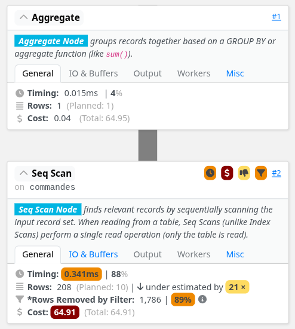

Ici, la clé primaire n'est pas utilisée car la fonction EXTRACT empêche l'utilisation d'un index sur datecom. Pour optimiser cette requête, on peut reformuler la condition pour utiliser une plage de dates, ce qui permettra à PostgreSQL d'utiliser un index sur datecom si disponible.

Voici la requête optimisée :

```sql
--Requête SQL optimisée
SELECT COUNT (*)
FROM commandes
WHERE datecom >= '2017-01-01' AND datecom < '2018-01-01';

--Plan d'exécution optimisé
EXPLAIN (analyse,buffers)
SELECT COUNT (*)
FROM commandes
WHERE datecom >= '2017-01-01' AND datecom < '2018-01-01';

                    QUERY PLAN                                                                  
--------------------------------------------------
 Aggregate  (cost=13.02..13.03 rows=1 width=8) (actual time=0.213..0.215 rows=1.00 loops=1)
   Buffers: shared hit=4
   ->  Index Only Scan using commandes_pkey on commandes  (cost=0.28..12.50 rows=211 width=0) (actual time=0.079..0.165 rows=208.00 loops=1)
         Index Cond: ((datecom >= '2017-01-01'::date) AND (datecom < '2018-01-01'::date))
         Heap Fetches: 0
         Index Searches: 1
         Buffers: shared hit=4
 Planning:
   Buffers: shared hit=3
 Planning Time: 0.228 ms
 Execution Time: 0.265 ms
(11 rows)
```


On remarque que l'index sur la clé primaire `commandes_pkey` est maintenant utilisé, ce qui améliore considérablement les performances de la requête. Le temps d'exécution est passé de 0.389 ms à 0.265 ms, et le nombre de blocs lus a diminué de 35 à 4.

---

## Exercice 3

Cette Exercice 3 va nous permettre de comparer des plans d'execution Oracle et de donner un avis critique dessus.

### Partie 1

Soit le shéma relationnel suivant :

```sql
CREATE TABLE Artiste (
ID_artiste VARCHAR(4),
Nom VARCHAR(32),
Adresse VARCHAR(32)
);

CREATE TABLE Film (
ID_film VARCHAR(4),
Titre VARCHAR(32),
Annee VARCHAR(4),
ID_realisateur VARCHAR(4)
);

CREATE TABLE Joue (
ID_artiste VARCHAR(4),
ID_film VARCHAR(4)
);
```

#### Question 1

On nous demande de créer la requête SQL pour "Afficher le nom des acteurs et le titre des films où ils ont joués".

```sql
SELECT Artiste.Nom, Film.Titre
FROM Artiste
JOIN Joue ON Artiste.ID_artiste = Joue.ID_artiste
JOIN Film ON Joue.ID_film = Film.ID_film;
```

#### Question 2

Son expression en algèbre relationnelle (PEL) est la suivante :

π_{Nom, Titre} (Artiste ⋈{Artiste.ID_artiste = Joue.ID_artiste} Joue ⋈{Joue.ID_film = Film.ID_film} Film)

#### Question 3

Cette question est la plus interessante car elle nous demande d'analyser le plan d'exécution Oracle suivant :

1. Plan 1 -> il n’existe que deux index, un sur FILM(ID−realisateur), et un sur ARTISTE(ID−
artiste)

```
0 SELECT STATEMENT
1 MERGE JOIN
2 SORT JOIN
3 NESTED LOOPS
4 TABLE ACCESS FULL JOUE
5 TABLE ACCESS BY ROWID ARTISTE
6 INDEX UNIQUE SCAN ARTISTE_IDX
7 SORT JOIN
8 TABLE ACCESS FULL Film
```

Nous pouvons représenter ce plan d'exécution sous forme d'arbre :

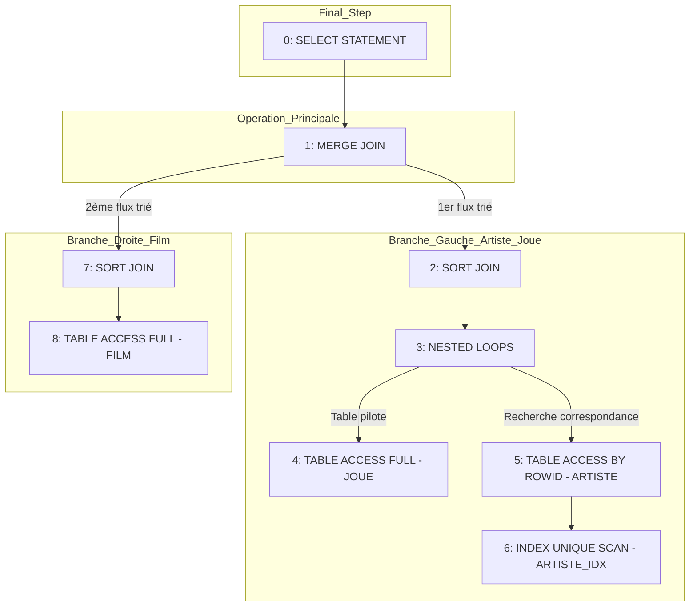


2. Plan 2 -> un index sur FILM(ID −Film), et un sur JOUE(ID −Artiste)

```
0 SELECT STATEMENT
1 NESTED LOOPS
2 NESTED LOOPS
3 TABLE ACCESS FULL ARTISTE
4 TABLE ACCESS BY ROWID JOUE
5 INDEX RANGE SCAN JOUE_ARTISTE
6 TABLE ACCESS BY ROWID FILM
7 INDEX UNIQUE SCAN FILM_IDX
```

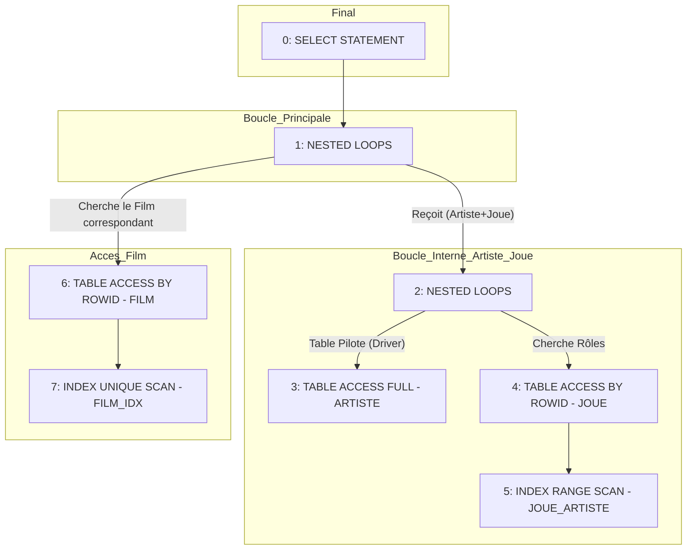

3. Plan 3 -> un index sur FILM(ID −Film), et un sur JOUE(ID −Film)

```
0 SELECT STATEMENT
1 MERGE JOIN
2 SORT JOIN
3 NESTED LOOPS
4 TABLE ACCESS FULL JOUE
5 TABLE ACCESS BY ROWID FILM
6 INDEX UNIQUE SCAN FILM_IDX
7 SORT JOIN
8 TABLE ACCESS FULL ARTISTE
```

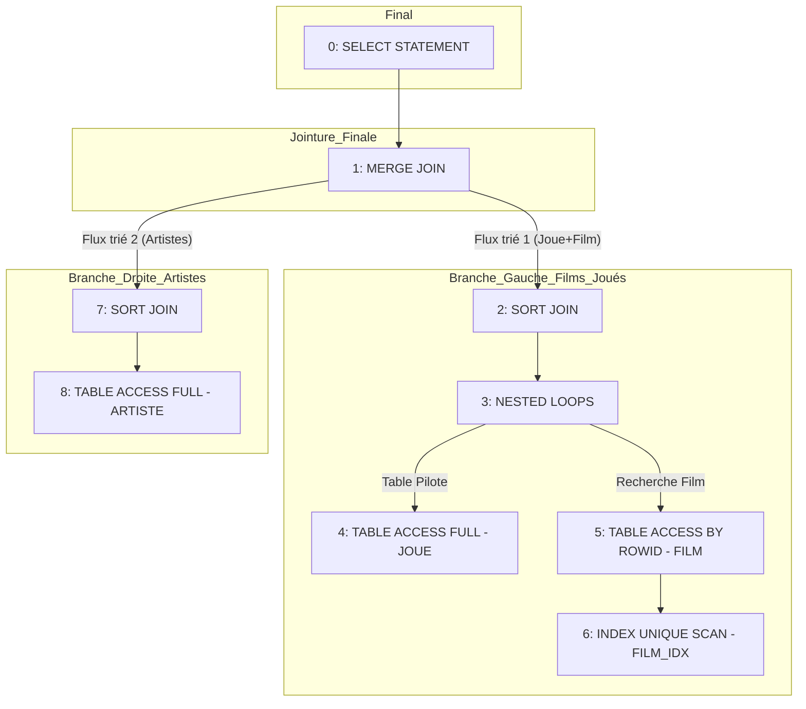

#### Analyse détaillée des plans d'exécution

##### Plan 1 (a) - Index sur FILM(ID_realisateur) et ARTISTE(ID_artiste)

**Parcours séquentiel :**
- Le parcours séquentiel (TABLE ACCESS FULL) est effectué sur les tables **JOUE** (ligne 4) et **FILM** (ligne 8).

**Index utilisés pour la jointure :**
- L'index **ARTISTE_IDX** (sur ID_artiste) est utilisé pour la jointure entre JOUE et ARTISTE.

**Table alternative pour le parcours séquentiel :**
- On aurait pu faire le parcours séquentiel sur la table **ARTISTE** plutôt que sur JOUE, puisque les deux tables doivent de toute façon être parcourues. Le choix de JOUE comme table pilote est probablement dû à sa taille ou à ses statistiques.

**L'index sur ID_realisateur est-il utilisable ?**
- Non, l'index sur FILM(ID_realisateur) **n'est pas utilisable** pour cette jointure car :
  - La jointure entre JOUE et FILM se fait sur **JOUE.ID_film = FILM.ID_film**
  - L'index existant porte sur **FILM.ID_realisateur**, qui n'intervient pas dans cette condition de jointure
  - Pour que l'index soit utilisable, il faudrait un index sur FILM(ID_film), pas sur FILM(ID_realisateur)

##### Plan 2 (b) - Index sur FILM(ID_Film) et JOUE(ID_Artiste)

**Pourquoi ARTISTE est choisi pour le parcours séquentiel initial ?**

La table ARTISTE est choisie comme table pilote (driver) pour le parcours séquentiel initial (ligne 3: TABLE ACCESS FULL ARTISTE) pour plusieurs raisons :

1. **Cardinalité favorable** : ARTISTE contient probablement moins de tuples que les autres tables, ce qui minimise le nombre d'itérations dans les boucles imbriquées.

2. **Optimisation des index disponibles** : 
   - L'index JOUE_ARTISTE (sur ID_Artiste) permet d'accéder efficacement aux rôles de chaque artiste
   - L'index FILM_IDX (sur ID_Film) permet ensuite d'accéder directement aux films correspondants

3. **Stratégie de jointure** : En commençant par ARTISTE, on peut exploiter les deux index disponibles (JOUE_ARTISTE et FILM_IDX) pour les jointures successives, ce qui est plus efficace que de commencer par une table qui nécessiterait plus de parcours séquentiels.

4. **Algorithme NESTED LOOPS** : Cette stratégie fonctionne bien quand la table externe (driver) est petite et que les tables internes peuvent être accédées efficacement via des index, ce qui est le cas ici.

##### Plan 3 (c) - Index sur FILM(ID_Film) et JOUE(ID_Film)

**Index utilisés pour la jointure :**
- L'index **FILM_IDX** (sur ID_film) a servi à la jointure entre les tables **JOUE** et **FILM** (ligne 6: INDEX UNIQUE SCAN FILM_IDX).

**Pourrait-on inverser l'ordre dans cette jointure ?**
- Non, on ne peut pas facilement inverser l'ordre de cette jointure car :
  - JOUE est la table pilote (ligne 4: TABLE ACCESS FULL JOUE)
  - Pour chaque ligne de JOUE, on recherche le FILM correspondant via l'index FILM_IDX
  - Si on inversait (FILM comme pilote), il faudrait un index sur JOUE(ID_Film) pour accéder efficacement aux rôles, ce qui n'est pas explicitement mentionné comme index disponible dans ce plan
  - L'inversion serait possible mais moins performante sans l'index approprié

**Algorithme utilisé pour la seconde jointure :**
- L'algorithme utilisé pour la seconde jointure est le **MERGE JOIN** (ligne 1).
- Cet algorithme fonctionne en :
  1. Triant les deux flux de données (SORT JOIN aux lignes 2 et 7)
  2. Fusionnant les résultats triés : le flux gauche contient (JOUE + FILM) et le flux droit contient ARTISTE
  3. La fusion se fait en parcourant simultanément les deux flux triés par ID_artiste
- Le MERGE JOIN est efficace ici car il traite des flux déjà triés et évite les recherches répétées caractéristiques des NESTED LOOPS.


